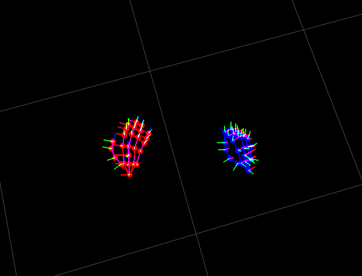
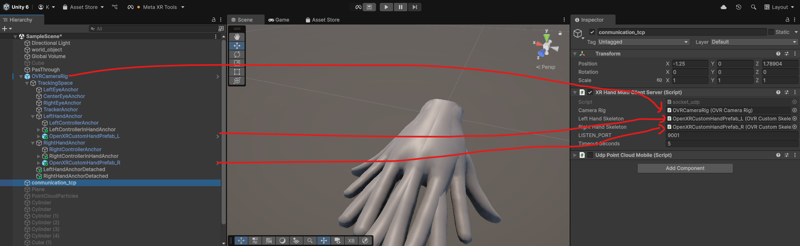

# 🖐️ Meta Quest Hand Tracking Viewer (UDP Receiver for Python)

This repository provides a **Python-based 3D visualizer** that receives real-time hand-tracking data streamed from **Unity3D with Meta Quest**, using **UDP protocol**.

- ✅ Wrist pose (world coordinates)
- ✅ 25 bone poses (relative to wrist, position + rotation)
- ✅ Coordinate system transform (Unity → Robot/World)
- ✅ Real-time 3D rendering with bone connections and axis directions

---

## 📸 Demo

  
_(Add your screenshot or demo GIF here)_

---

## 🔗 Project Overview

### Unity Side (Transmitter)
- Meta Quest hand-tracking (OVRHand)
- Each hand sends:
  - Wrist pose: position (3 floats) + rotation (quaternion, 4 floats)
  - 25 bones: relative position (3 floats) + rotation (quaternion, 4 floats) each
  - Total = `2 * (3+4 + 25*(3+4)) + 7` = `2 * 91 + 7` = 189 floats = 728 bytes × 2 + 28 bytes + header/footer 

### Python Side (Receiver)
- Receives 1500-byte packet:
  - 4-byte header `"HND0"`
  - 8-byte timestamp (`double`)
  - 728 bytes for each hand (182 floats each)
  - 28 bytes for headset
  - 4-byte footer `"HND1"`
- Parses and visualizes each hand's absolute pose in real-time.

---

## 🛠 Requirements

- Python 3.8+
- PyQt5
- PyQtGraph
- NumPy
- SciPy

Install dependencies:
```bash
pip install PyQt5 pyqtgraph numpy scipy
```

---

## 🚀 How to Run

0. **Build the MetaAPP** 
    

    or

    **Download MYAPP** 
    (https://www.notion.so/MetaQuest-22dfad65497280f4aadaf1835ecbe7e3?source=copy_link#22dfad654972806a8cdadf09e9a4ddcb)

1. **Run the MetaAPP**

2. Then run this Python visualizer:
```bash
python hand_tracking_udp_receiver.py
```

If you're running on a remote X server or WSL2:
```bash
export DISPLAY=192.168.0.X:0.0
export LIBGL_ALWAYS_INDIRECT=1
python hand_tracking_udp_receiver.py
```

---

## 🧠 Coordinate Transformation

The code transforms Unity’s coordinate system to robot/world coordinates:

```python
RM_U2R = np.array([
    [0, 0, 1],    # x' = z
    [-1, 0, 0],   # y' = -x
    [0, 1, 0]     # z' = y
])
```

- All bone positions are transformed with `pos @ RM_U2R.T`
- All rotations are transformed using `RM_U2R @ R.as_matrix()` (no back-conversion to Rotation object)

---

## 📊 Features

- Real-time 3D bone visualizer with PyQtGraph
- Frame rate + latency monitoring
- Palm and finger connection rendering
- Local axis (XYZ) drawing per joint
- Dual-hand support (left/right)

---

## 📁 Folder Structure

```
.
├── hand_tracking_udp_receiver.py   # Main Python visualizer
├── docs/
│   └── screenshot.png              # Example rendering output
└── README.md
```

---

## 🔒 License

MIT License (feel free to adapt for research or commercial use)

---

## 🙏 Credits

Created by [KO DAEKWAN]  
Meta Quest SDK (OVRHand), Unity3D, PyQtGraph

---

## 🦴 Bone Connection Topology

The hand bone connection structure used for drawing finger joints is based on the XRHand (Meta Quest) indexing:

```python
bone_connection = [
    (0, 1), (1, 2), (2, 3), (3, 4), (4, 5),           # Thumb
    (1, 6), (6, 7), (7, 8), (8, 9), (9, 10),          # Index
    (1, 11), (11, 12), (12, 13), (13, 14), (14, 15),  # Middle
    (1, 16), (16, 17), (17, 18), (18, 19), (19, 20),  # Ring
    (1, 21), (21, 22), (22, 23), (23, 24), (24, 25),  # Little
    (2, 6), (6, 11), (11, 16), (16, 21)               # palm transverse
]
```

This defines:
- Linear finger joint connectivity
- Palm cross-line connections
- Suitable for rendering hand skeletons in 3D